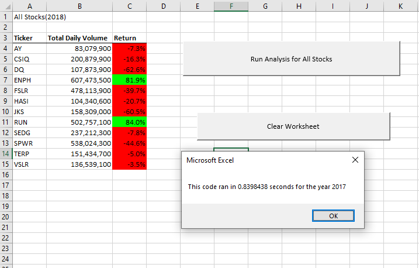
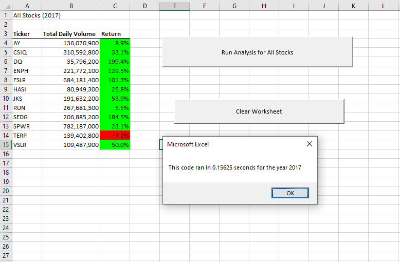
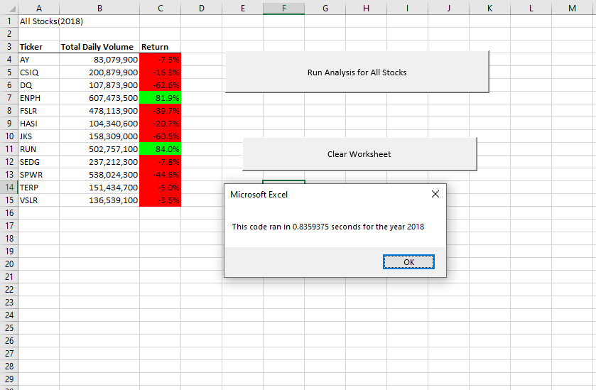
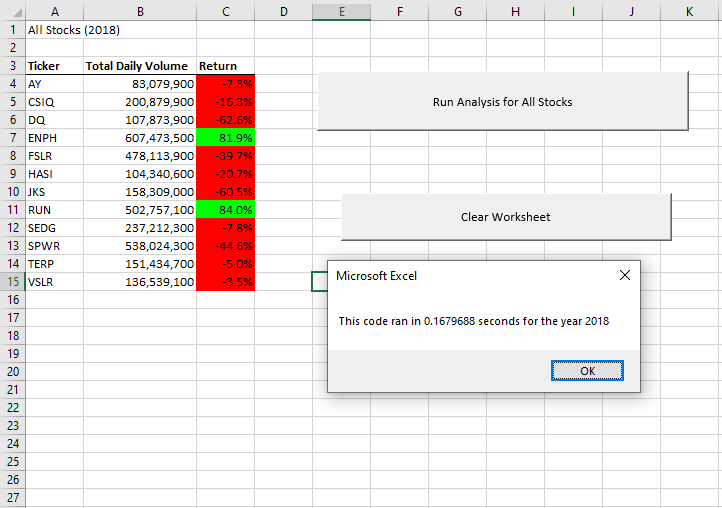

# Refactoring Stock Workbook VBA Code

## Overview of Project
For Module 2, a solution code was prepared and given to Steve to help better analyze the stock his parents had invested into. The workbook created allowed for Steve to analyze the dataset with the press of one button created in the workbook. However, the dataset only contained data for only around a dozen or so stocks and Steve wants to expand it to include the entire stock market over the last few years. The solution code created may have worked efficiently for around a couple of stocks however, it may not work for thousands of stock options. Our purpose for this challenge is to refactor the code to ensure it will run in a shorter amount of time and compare the time differences with the old Module 2 solution to allow for faster analysis outputs.

## Results

Upon refactoring code to allow for an increased ticker volume, we were able to analyze the data in a fraction of time according to the messagebox displaying the time it took to run the code.
### 2017 (Solution Code)

### 2017 (Refactored Code)

Running the refactored code showed that prior to refactoring, the 2017 analysis code took around .84 seconds to complete analysis. The 2017 refactored code meanwhile, took around .16 seconds to run. The difference is significantly noticeable as the refactored code managed to perform the analysis at 1/5 the speed it took the original solution code to perform.  

### 2018 (Solution Code)

### 2018 (Refactored Code)

Upon comparison of the two codes when it comes to the 2018 stock analysis data, the images shows that the original code took roughly .83 seconds to complete whereas the refactored code came in at roughly 1/5 of that time at .17 seconds again.

The difference in speed alone proves that this new edited version of the code is more efficient espeically time efficient in analyzing stock value. In other terms, the new code ran the anaysis five times faster. In the world of cliche economics, time certainly is money and any business would certainly agree that having the same amount of work performed five times faster is to the betterment of the company, its interests, and to the consumers it caters to.

